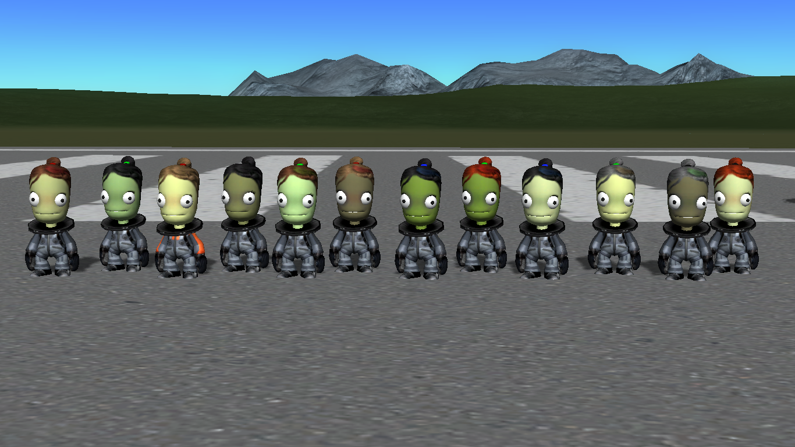

# Diverse Kerbal Lasses continued

GreeningGalaxy's Diverse Kerbal Lasses for **KSP 1.9.1** with **[TextureReplacer](https://forum.kerbalspaceprogram.com/index.php?/topic/96851-19x-texturereplacer-413-2322020/page/32/&tab=comments#comment-2049913) 4.1.3**.

This is a very nice set of CC-licensed Kerbal head textures, which deserves better than to be lost to the mists of time. The original download links on the KSP forum have been dead for a long while, and the internet did not have these textures available anywhere else.

Where would [my KSP 1.0.4 campaign](https://imgur.com/a/PyWRT) back in 2015 have been without Madsei Kerman, the blonde test pilot?

## About this package

The directory structure has been reorganized to the format used by TR 4.1.3. The actual texture files are taken from the original *Diverse Kerbal Lasses* packages as-is.

As of this writing (March 2020), the original creator of the textures, GreeningGalaxy, last visited the KSP forums in June 2018. So, as per the license specified by the original creator, I'm taking the liberty of providing this updated package to keep this set of textures working and available.

I obtained the textures from the original download links back in 2015 when playing KSP 1.0.4. I didn't have the template (a.k.a the Lass GIMP File); it was kindly [provided by Corax](https://forum.kerbalspaceprogram.com/index.php?/topic/96851-19x-texturereplacer-413-2322020/page/96/&tab=comments#comment-3765185), who had similarly archived a local copy.

If the original creator comes back, I'm more than willing to hand the maintenance back to them. Or to anyone willing to take over, actually; for me, this is a one-time conversion effort, and I'm unlikely to maintain this package further.

All credit belongs to the original creator, GreeningGalaxy. The license is CC BY 4.0, as can be seen from [the badge URL](https://i.creativecommons.org/l/by/4.0/88x31.png) in the original forum post.

Crash early, crash often,

 -Technologicat

## Install

Requires [TextureReplacer](https://forum.kerbalspaceprogram.com/index.php?/topic/96851-19x-texturereplacer-413-2322020/page/32/&tab=comments#comment-2049913).

Merge the `TextureReplacer` folder from this package into the `TextureReplacer` folder in your `GameData`, and you're done.

## Original README

This section comes from [the original forum post by GreeningGalaxy](https://forum.kerbalspaceprogram.com/index.php?/topic/96851-19x-texturereplacer-413-2322020/page/32/&tab=comments#comment-2049913), with minimal changes for formatting.

**INTRODUCING**:

**GreeningGalaxy's Diverse Kerbal Lasses**

Kerbal Head Texture Pack!

*License*:  *([CC BY 4.0](https://creativecommons.org/licenses/by/4.0/))*

*Posted* July 8, 2015 (edited)  
*Edited* August 24, 2017 by GreeningGalaxy

### Basic Lasses

This is the basic release, which includes relatively 'normal'-looking kerbal heads for the default 'female' model. These heads are have several different skin and hair colors, as well as a few different colors and styles of makeup. At present, there are 16 different options. Additional packs with different features will become available later.

It turns out drawing hair is about as hard as I expected, especially considering that I have no art skills to speak of and nothing besides a mouse to draw with. All these hairstyles (at the moment, there are three textures) were made by stitching together photos of real hair - the long wavy one is my hair, while the other two are from my friends.

### Serious Lasses

These packs were originally planned to add only especially feminine heads, since there didn't appear to be very many of those available previously. However, I now see that there's also a profound lack of diverse skin colors in the female head scene, so here's some heads for those of you who would prefer those without the makeup from the other two packs.

This pack includes only 12 heads instead of the usual 16 at the moment, but that will change once I add additional hairstyles (and thus have more variability to work with). Unlike the original basic pack, none of the Serious Lasses are wearing lipstick or eyeliner, and the contouring has been made much more subtle. Three new closer-to-stock variants of eyelashes have been added, as well as two new mid-toned skin shades. Subtle hair highlights have been retained, but all-blue hair has not.

### Gothy Lasses

This release adds an additional 16 heads with more unusual makeup options - things like black/blue/green lipstick, bright red/green hair, and blue/gray skin.

### Lass GIMP File

If you want to mix and match your own kerbal heads using features from this pack, the best way to do that is to use the GIMP to open the original `.xcf` file [[kerbalGirl_Base_2.xcf](kerbalGirl_Base_2.xcf)], which is provided below. A number of layers corresponding to different colors for different features are included, or you can make your own. This will be updated with new options as they become available.

To make a customized texture using the file, just open it, enable, disable and modify layers as you like, and then export it to `GameData/TextureReplacer/Heads`. Also, don't forget to add the exported filename to one of the `.cfg` files in the `TextureReplacer` directory under `femaleHeads`!

This file was last updated on 2015-7-11.

*[Update March 2020, by Technologicat: These install instructions are outdated. For up-to-date instructions on installing textures to TextureReplacer, see [the README](https://github.com/ducakar/TextureReplacer) in TR's official GitHub repo. The SHA256 checksum of the `.xcf` differs from the original; Corax said it's probably due to layer visibility changes. The file has been tested to work in GIMP 2.8.]*

Note: I don't think Photoshop will support the .xcf format, but I admit I don't know since I don't use Photoshop. GIMP is free in any case, but if you really want a .psd file or whatever Photoshop takes these days, I think it can be arranged.

 -GreeningGalaxy
